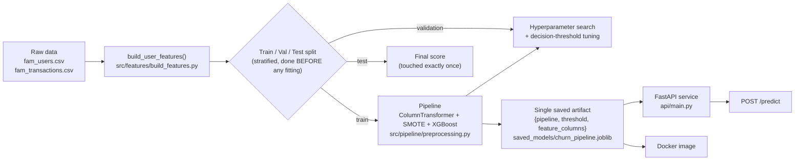

# User Churn Prediction — FamApp

A churn-prediction service for a fintech app's users, rebuilt from an earlier
notebook-based project into a **production-style, leakage-free ML pipeline**
with a served API, config-driven training, and a test suite.

This repo intentionally keeps **both versions** of the project side by side —
the original notebooks in [`legacy_v1/`](legacy_v1/), and the rebuilt version
at the repo root — because the most useful part of this project isn't the
model, it's the audit: finding and fixing real methodology bugs in my own
earlier work.

---

## Demo

- 🎥 **Video walkthrough:** _[add link after uploading — see "Adding the demo video" below]_
- 📊 **Slide deck (original problem framing / EDA):**
[PPT.pdf](https://github.com/user-attachments/files/31675628/PPT.pdf)

<details>
<summary>Adding the demo video (click to expand)</summary>

GitHub can't embed a video from a plain link in a README, but it *can* host
one natively:

1. On GitHub.com, open this file for editing (pencil icon on `README.md`).
2. Drag your `.mp4` file directly into the text-edit box.
3. GitHub uploads it and inserts a link — commit the change, and the video
   plays inline wherever you pasted it.

If you'd rather host on YouTube/Loom instead, embed a thumbnail image and
link it to the video URL, since GitHub markdown won't render a live player
from an external embed.
</details>

---

## TL;DR

| | |
|---|---|
| **Problem** | Predict which FamApp users are likely to churn (go inactive), so retention campaigns can target them before they leave |
| **Original approach** | 3 notebooks: EDA → training → interpretation |
| **What was wrong with it** | Multiple forms of data leakage inflated the reported metrics — see the deep-dive below |
| **This rebuild** | One `sklearn`/`imblearn` pipeline, config-driven, config in one file, served over FastAPI, Dockerized, tested with `pytest` |
| **Verified** | 7/7 tests pass; full train → save → serve cycle runs end-to-end |

---

## Architecture



Every stateful step — encoding, scaling, SMOTE resampling, the model itself —
lives inside **one** fittable pipeline object. That's not a style choice;
it's what makes half the bugs below structurally impossible to reintroduce.

---

## The leakage audit — what was wrong, and how I found and fixed it

This is the core of the project. "Leakage" means information that shouldn't
be available at prediction time — or that was allowed to flow from
validation/test data into training — is influencing the model, making
offline metrics look better than the model will ever perform in production.

### 1. Preprocessing fit before the train/test split
**The bug:** the scaler and feature-selection step in the original notebooks
were fit on the *entire* dataset, then the data was split afterward.
**Why it's leakage:** the scaler's mean/variance (and any feature-selection
decision) is computed using statistics from rows that later become the test
set. The model is technically training on information about the shape of
the test data.
**How I found it:** by reading the notebook top-to-bottom in execution
order and checking *when* `train_test_split` was called relative to every
other `.fit()` call — leakage from split order is almost always visible this
way, it's rarely subtle once you check the sequence.
**The fix:** `train_test_split` runs first, on raw data. Every transform
that has a `.fit()` (scaler, encoder, feature selector) is a step inside a
single `Pipeline`, so it is only ever fit on `X_train`.

### 2. SMOTE applied outside cross-validation
**The bug:** SMOTE (synthetic oversampling of the minority/churn class) was
applied once to the whole training set before running cross-validation.
**Why it's leakage:** SMOTE generates synthetic points by interpolating
between real minority-class neighbors. If it's applied before the CV split,
synthetic points derived from a validation-fold row can end up in the
training fold of that same row (or vice versa) — the model is partially
evaluated on data it was indirectly trained on.
**How I found it:** checked whether the resampling step appeared inside or
outside the `cross_val_score`/`GridSearchCV` call — if a `.fit_resample()`
happens before the CV loop starts, that's the signature of this bug.
**The fix:** SMOTE is a step inside an `imblearn.pipeline.Pipeline`, so
`GridSearchCV` refits (and re-resamples) it independently on each fold's
training portion only.

### 3. The test set was reused for both tuning and final evaluation
**The bug:** the same held-out set was used to pick the best model, tune the
decision threshold, *and* report the final metric.
**Why it's leakage:** every time you use a "test" set to make a decision
(pick a model, pick a threshold), you're fitting a decision to it — it stops
being an unbiased estimate of real-world performance. This is sometimes
called "test-set leakage via repeated use."
**How I found it:** traced every place the notebook referenced the test
variable — it showed up in the model-selection cell, the threshold cell,
*and* the final metrics cell.
**The fix:** three-way split. `validation` is used for hyperparameter search
and threshold selection; `test` is scored exactly once, at the very end,
after the pipeline and threshold are already frozen.

### 4. Non-reproducible, "as-of-today" time features
**The bug:** recency features (e.g. days since last transaction) were built
using `pd.to_datetime("today")`.
**Why it's a problem:** the feature's value silently changes depending on
what day you run the notebook — training data built on one date and
inference built on another date are not comparable, and you can't reproduce
a past training run.
**How I found it:** any call to `"today"`, `"now"`, or `datetime.now()` in a
feature-engineering function is a red flag worth grepping for on its own.
**The fix:** `build_user_features()` takes an explicit `as_of_date`
parameter everywhere; there is no wall-clock date anywhere in the feature
code.

### 5. Silent `dropna()` on cold-start users
**The bug:** `dropna()` was used to clean up rows with missing
transaction-derived features, which silently dropped ~8% of users who had
no transaction history yet.
**Why it's a problem:** those users don't fail randomly — they're
disproportionately brand-new signups. Training only on users with enough
history, then deploying the model on *all* users (including brand-new
ones), means the model is asked to score exactly the population it never
saw in training.
**The fix:** cold-start users are explicitly detected and routed to a
separate "insufficient data" segment instead of being scored by the model
or silently dropped from training.

### 6. Hardcoded paths, thresholds, and hyperparameters
**The bug:** file paths, the decision threshold, and model hyperparameters
were typed directly into multiple notebook cells.
**Why it's a problem:** it's not leakage in the statistical sense, but it's
the reason bugs like #1–#4 are easy to introduce and hard to catch — nothing
forces training and inference to agree on the same values.
**The fix:** everything tunable lives in `config/config.yaml`; nothing in
`src/` hardcodes a path, threshold, or hyperparameter.

### 7. Ambiguous saved model
**The bug:** the model was saved with `joblib.dump(model, ...)` alone, so a
later notebook had to guess which version of the data (scaled or unscaled)
matched it.
**The fix:** one artifact is saved: `{pipeline, threshold, feature_columns}`
— it's impossible to load the model without also loading the exact
preprocessing and feature order it expects.

### General checklist: how to spot leakage in any project
- Metrics that are *suspiciously* high for a real-world tabular problem (a
  near-perfect AUC on messy human-behavior data is a signal to double-check
  before celebrating).
- Any `.fit()` call that happens before `train_test_split`.
- Any resampling (SMOTE, undersampling) applied outside a CV loop.
- Any feature computed relative to "now"/"today" instead of a fixed
  reference date.
- The same held-out set used more than once for a decision (model choice,
  threshold, hyperparameters, *and* final score).
- A `dropna()`/`fillna()` that changes the population size — always check
  *who* gets dropped, not just how many rows.
- One feature dominating feature importance — check whether it could only
  be known *after* the outcome already happened.

---

## Project layout

```
config/config.yaml          # every path, threshold, hyperparameter — nothing hardcoded in code
src/
  data/                      # raw data loading + synthetic data generator for demos/CI
  features/build_features.py # single source of truth for feature engineering (train + inference)
  pipeline/preprocessing.py  # ColumnTransformer + SMOTE + model, one fittable object
  models/train.py            # split -> tune -> threshold -> evaluate -> save ONE artifact
  inference/predict.py       # batch scoring, cold-start handling, risk banding
  utils/config.py            # config loader + logger
api/main.py                  # FastAPI serving layer
tests/                       # pytest unit tests
notebooks/                   # exploratory / advanced-modeling notebook
legacy_v1/                   # original 3-notebook version + slide deck, kept for reference
Dockerfile
requirements.txt
```

---

## Quickstart

```bash
pip install -r requirements.txt
export PYTHONPATH=$(pwd)

# 1. No real data on hand? Generate a synthetic dataset with the same schema:
python -m src.data.generate_synthetic_data

# 2. Run tests
pytest tests/ -v

# 3. Train (fixes leakage, tunes hyperparameters, saves saved_models/churn_pipeline.joblib)
python -m src.models.train

# 4. Serve
uvicorn api.main:app --reload --port 8000
curl -X POST localhost:8000/predict -H "Content-Type: application/json" -d '{"user_id": 1, ...}'
```

To use **real** data, drop `fam_users.csv` / `fam_transactions.csv` into
`data/raw/` (paths are configurable in `config/config.yaml`) and skip step 1.

### Docker

```bash
docker build -t churn-service .
docker run -p 8000:8000 churn-service
```

---

## Results — and an honest caveat

Running the full pipeline against the bundled **synthetic** data generator:

- `pytest tests/` → 7/7 passed
- Validation ROC-AUC / churn recall: ~0.999 / ~0.995
- Test ROC-AUC: ~1.0

**These near-perfect numbers reflect the synthetic data generator, which
produces a cleanly separable signal — not a claim about real-world
accuracy.** On messy production data, expect meaningfully lower and noisier
numbers. The actual value of this project isn't the score; it's that the
methodology producing that score is now free of the leakage described
above, so whatever number comes out of real data will be trustworthy rather
than inflated.

---

## What's still needed for a full production rollout

This project fixes the modeling/engineering issues and gives you a
deployable service — it does **not** include, and a real rollout should add:

- **CI/CD:** a GitHub Actions workflow running `pytest` and a minimum-AUC
  gate on every PR, auto-building/pushing the Docker image.
- **Experiment tracking / model registry:** log each training run (params,
  metrics, data snapshot) to MLflow or similar, and promote to production
  only when a challenger beats the incumbent on the untouched test set.
- **Feature store / scheduled feature refresh:** right now
  `build_user_features` is called on-demand; at real scale you'd
  materialize it on a schedule.
- **Monitoring:** track input feature drift and prediction-distribution
  drift over time, alert when they move, and set a retraining trigger.
- **A/B or shadow evaluation:** validate the model against real business
  outcomes before it drives retention campaigns.

---

## Original version

The original 3-notebook project (`01_EDA_Feature_Engineering`,
`02_Model_Training_Evaluation`, `03_Model_Interpretation_Business_Insights`)
and its slide deck are preserved in [`legacy_v1/`](legacy_v1/) for anyone who
wants to see the before state this project was rebuilt from.
