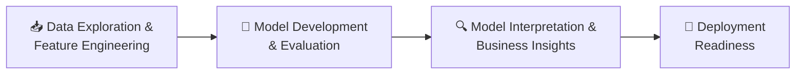

<div align="center">

# 📊 FamPay Churn Analysis
### Predicting User Churn to Power Data-Driven Retention Strategy

*An end-to-end machine learning case study on user behavior, attrition risk, and retention insights for a fintech app serving young users across India.*

<br/>


<br/>

**[📽️ Watch the Demo](#-demo) · [📑 View the Presentation](#-presentation) · [📓 Explore the Notebooks](#-project-structure) · [📈 See the Results](#-model-performance)**

</div>

---

## 📌 Overview

FamPay helps young users across India kickstart their financial journey. Like any consumer app, **user attrition (churn)** is one of its biggest growth risks — and understanding *who* is likely to churn, and *why*, is critical to building effective retention strategies.

This project delivers a complete churn-prediction pipeline: from raw user and transaction data, through feature engineering and exploratory analysis, to a tuned, production-ready **XGBoost classifier** with **explainable, business-actionable insights** derived using SHAP.

> **Objective**
> 1. Develop a machine learning model to predict user churn using behavioral and transactional data.
> 2. Translate model findings into concrete, actionable strategies to reduce churn.

---

## 🎥 Demo

<div align="center">

|  |  |
|---|---|
| 📽️ **Walkthrough Video** | [Add your demo video link here — e.g. Loom / YouTube / Drive] |
| 🖥️ **Live Notebook Preview** | [Add nbviewer / Colab link here] |
| 📊 **Interactive Dashboard** (optional) | [Add Streamlit / dashboard link here] |

</div>

> *Tip: Once you have a recording, embed it as a GitHub-hosted MP4/GIF, or drop a badge that links to YouTube/Loom — GitHub READMEs don't autoplay video, but a thumbnail + link works great.*

```md
[](https://your-video-link-here.com)
```

---

## 📑 Presentation

The full stakeholder-facing summary — problem framing, methodology, results, and recommendations — is available as a polished slide deck:

📄 **[`PPT.pdf`](./PPT.pdf)** — *FamPay Churn Analysis, Abhishek Kumar, IIT Bombay*

---

## 🧭 Table of Contents

- [Overview](#-overview)
- [Demo](#-demo)
- [Presentation](#-presentation)
- [Project Structure](#-project-structure)
- [Dataset](#-dataset)
- [Methodology](#-methodology)
- [Exploratory Data Analysis](#-exploratory-data-analysis)
- [Feature Engineering](#-feature-engineering)
- [Model Performance](#-model-performance)
- [Model Interpretation (SHAP)](#-model-interpretation-shap)
- [Business Recommendations](#-business-recommendations)
- [Tech Stack](#-tech-stack)
- [Getting Started](#-getting-started)
- [Results Summary](#-results-summary)
- [Future Work](#-future-work)
- [Author](#-author)

---

## 🗂️ Project Structure

```
fampay-churn-analysis/
│
├── 01_EDA_Feature_Engineering.ipynb            # Data cleaning, EDA, feature engineering
├── 02_Model_Training_Evaluation.ipynb          # Model training, tuning, evaluation
├── 03_Model_Interpretation_Business_Insights.ipynb  # SHAP-based interpretation & insights
├── PPT.pdf                                     # Stakeholder presentation deck
└── README.md                                   # You are here
```

Each notebook is a self-contained phase of the pipeline, designed to be read and run in sequence:

| # | Notebook | Purpose |
|---|-----------|---------|
| 1️⃣ | `01_EDA_Feature_Engineering.ipynb` | Load raw user & transaction tables, clean data, engineer features, run univariate/bivariate/correlation analysis, encode & scale |
| 2️⃣ | `02_Model_Training_Evaluation.ipynb` | Train/test split, handle class imbalance (SMOTE), train Logistic Regression / Random Forest / XGBoost, tune hyperparameters, evaluate |
| 3️⃣ | `03_Model_Interpretation_Business_Insights.ipynb` | SHAP-based global & local feature importance, per-user explanations, business recommendations |

---

## 🧬 Dataset

The analysis is built on two core data sources joined into a single modeling table:

| Table | Contents |
|---|---|
| **User Table** | Demographics (age, gender), app behavior (session frequency, activity logs) |
| **Transaction Table** | Transaction amounts, timestamps, transaction frequency |
| **Target Variable** | `churn` — `0` = churned (inactive), `1` = retained (active) |

**Scale:** 463,308 rows × 20 columns after merging and cleaning.

**Class balance:** ~20% of users are churned/inactive — a real-world imbalanced classification problem, addressed explicitly during modeling.

---

## 🔬 Methodology

The project follows a structured, four-phase approach:



1. **Data Exploration & Feature Engineering** — uncover behavioral patterns, engineer meaningful features from raw logs.
2. **Model Development** — train and evaluate multiple models against standard *and* business-centric metrics.
3. **Model Interpretation & Business Insights** — identify churn drivers, segment users by risk, derive retention strategies.
4. **Deployment Readiness** — package a Python module for real-time prediction with a plan for monitoring and maintenance.

---

## 📊 Exploratory Data Analysis

Key findings from the EDA phase:

- **Churn distribution:** ~20% of users are inactive (churned) — meaningful class imbalance, handled via **SMOTE** during training.
- **Age distribution:** ~80% of users are teens (16–18 age group dominant); churn rate is *fairly consistent* across all age groups (17–23%), suggesting age alone is **not** a strong linear predictor — churn is likely driven by non-linear or interaction effects.
- **Strongest early signal:** `days_since_last_transaction` shows a clear separation between churned and active users (some outliers present).
- **Other promising predictors:** `avg_screen_duration`, `app_opens_per_week`.
- **Correlation structure:** Most features are weakly correlated with each other, but a cluster of engagement features — `active_days`, `unique_merchants`, `total_transactions`, `days_between_first_and_last_txn` — are strongly *positively* inter-correlated and negatively correlated with churn.
- **Data quality:** ~36,692 rows (~8%) had missing values and were dropped to preserve data integrity. `transaction_failure_rate` was dropped entirely (zero variance, no signal).
- ⚠️ **Data leakage caught & fixed:** An initial "no preprocessing" training run produced a suspicious 100% accuracy. Root-cause analysis traced this to `days_since_last_transaction_x/y` leaking future information — these columns were removed before final modeling, restoring a realistic and trustworthy performance profile.

---

## 🛠️ Feature Engineering

New features engineered from raw user behavior and transaction logs:

- `total_amount_spent`
- `max_transaction_value`
- `days_since_last_transaction`
- `average_weekly_transactions`
- `app_opens_per_week`
- `session_duration_avg`
- ...and additional derived engagement metrics

**Preprocessing pipeline:**
- Missing/NaN values removed
- Numerical features normalized (`StandardScaler`)
- Categorical features encoded (label / one-hot)
- Feature selection via **mutual information** and **chi-squared p-values**
- Highly correlated redundant features pruned based on correlation analysis

---

## 🤖 Model Performance

Three model families were trained and benchmarked on both standard classification metrics and business-relevant metrics (precision/recall on the minority — *churned* — class):

| Model | Accuracy | Precision (Class 0) | Recall (Class 0) | F1 (Class 0) | ROC-AUC |
|---|:---:|:---:|:---:|:---:|:---:|
| Logistic Regression | 95% | 0.74 | 0.98 | 0.84 | 0.988 |
| Random Forest | 96% | 0.77 | 0.98 | 0.86 | 0.992 |
| **XGBoost** | **98%** | 0.90 | 0.90 | 0.90 | **0.9924** |
| **XGBoost (Tuned)** ⭐ | — | 0.90 | **0.93** | **0.91** | — |

🏆 **Best model: XGBoost (hyperparameter-tuned)** — chosen for deployment because it maximizes **recall on churned users**, i.e., it catches the most at-risk users, which is the metric that matters most for a retention use case (a missed churner is far costlier than a false alarm).

**Class imbalance handling:** SMOTE (Synthetic Minority Over-sampling Technique) applied to both scaled and non-scaled training sets.

**Threshold analysis:**
- Predicted probabilities are highly confident, with most predictions clustering near 0 or 1 and very few samples near the 0.5 decision boundary.
- A clear low-density gap exists between ~0.3 and ~0.7 — indicating strong class separability.
- Default threshold of 0.5 performs reliably; for business goals prioritizing churn capture, the threshold can be lowered to ~0.4 to trade some precision for higher recall.
- **Calibration curve** confirms predicted probabilities align well with true outcomes — the model is well-calibrated and trustworthy without further recalibration.

---

## 🔍 Model Interpretation (SHAP)

Global feature importance (mean absolute SHAP value):

| Rank | Feature | SHAP Impact | Interpretation |
|:---:|---|:---:|---|
| 1 | `days_between_first_and_last_txn` | **+5.85** | Dominant driver — longer engagement span strongly reduces churn risk |
| 2 | `total_transactions` | +2.03 | Higher transaction volume reduces churn |
| 3 | `active_days` | +0.31 | Moderate, less consistent impact |
| 4 | `unique_merchants` | +0.15 | Moderate, less consistent impact |
| — | 11 other features (combined) | +0.27 | Minor individual contributions |

**Key interpretive findings:**
- **Engagement duration** (`days_between_first_and_last_txn`) is by far the strongest churn signal — users with short active spans are far more likely to churn.
- **Transaction volume** is the second most important lever — more transactions correlate with retention.
- **Age (16–18 group)** has low individual SHAP impact, confirming from EDA that age is *not* a strong standalone churn predictor.
- Individual, user-level SHAP explanations were generated to show exactly which factors pushed a *specific* user's churn probability up or down — enabling targeted, explainable interventions rather than black-box scoring.

---

## 💡 Business Recommendations

1. **Prioritize engagement duration** — engagement span is the single strongest predictor of retention. Design onboarding and lifecycle campaigns that extend early activity into long-term habitual use.
2. **Boost transaction volume** — drive frequency through personalized offers, gamification, and loyalty rewards.
3. **Target short-tenure users early** — new users and users returning after a break show the sharpest churn risk; intervene with proactive engagement nudges within their first active window.
4. **Risk-based segmentation** — use SHAP scores to segment the user base by churn risk and prioritize retention spend on the highest-value, highest-risk segments.
5. **Operationalize the threshold** — tune the classification threshold (e.g., 0.4 instead of 0.5) when the business goal is to maximize churner capture, accepting a modest increase in false positives.

---

## 🧰 Tech Stack

<div align="center">

| Category | Tools |
|---|---|
| **Language** | Python 3.10+ |
| **Data Handling** | pandas, numpy |
| **Visualization** | matplotlib, seaborn |
| **Feature Selection** | scikit-learn (`mutual_info_classif`, `chi2`), scipy (`chi2_contingency`) |
| **Preprocessing** | scikit-learn (`StandardScaler`, `LabelEncoder`, `OneHotEncoder`) |
| **Imbalance Handling** | imbalanced-learn (`SMOTE`) |
| **Modeling** | scikit-learn (Logistic Regression, Random Forest), XGBoost |
| **Tuning & Evaluation** | `GridSearchCV`, `RandomizedSearchCV`, ROC-AUC, precision/recall/F1, calibration curves |
| **Interpretability** | SHAP |
| **Serialization** | joblib |

</div>

---

## 🚀 Getting Started

### Prerequisites

```bash
python -m venv venv
source venv/bin/activate   # Windows: venv\Scripts\activate

pip install pandas numpy matplotlib seaborn scikit-learn \
            imbalanced-learn xgboost shap joblib jupyter
```

### Run the pipeline

```bash
# 1. Data exploration & feature engineering
jupyter notebook 01_EDA_Feature_Engineering.ipynb

# 2. Model training & evaluation
jupyter notebook 02_Model_Training_Evaluation.ipynb

# 3. Model interpretation & business insights
jupyter notebook 03_Model_Interpretation_Business_Insights.ipynb
```

> 💡 Notebooks are meant to be run in order — later stages depend on artifacts (cleaned data, trained model) produced by earlier ones.

---

## 🏁 Results Summary

<div align="center">

| Metric | Value |
|---|:---:|
| Best Model | XGBoost (Tuned) |
| Overall Accuracy | 98% |
| ROC-AUC | 0.992 |
| Recall — Churned Class | 0.93 |
| Precision — Churned Class | 0.90 |
| Top Churn Driver | Engagement span (`days_between_first_and_last_txn`) |

</div>

---

## 🔮 Future Work

- [ ] Package the tuned model into a real-time prediction service / API
- [ ] Set up automated performance monitoring and drift detection
- [ ] A/B test retention interventions informed by SHAP-based segmentation
- [ ] Expand feature set with richer behavioral signals (e.g., support tickets, referral activity)
- [ ] Build a live dashboard for churn-risk monitoring by cohort

---

## 👤 Author

**Abhishek Kumar**
IIT Bombay

<div align="center">

*If you found this project useful, consider ⭐ starring the repository.*

</div>
