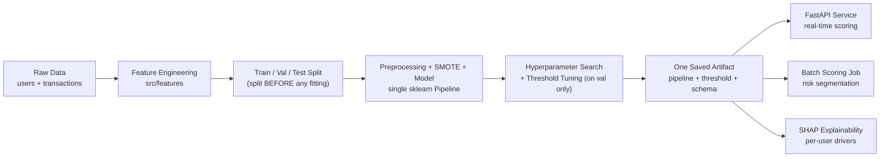

<div align="center">

# 📊 Churn Prediction — Production ML System
### End-to-End, Leak-Free Churn Modeling for a Fintech App

*A production-grade rebuild of an exploratory churn-analysis project — from a notebook prototype into a modular, tested, deployable machine learning system.*

<br/>


<br/>

**[📌 Overview](#-overview) · [🏗️ Architecture](#️-architecture) · [📈 Results](#-model-performance) · [🚀 Getting Started](#-getting-started) · [🔌 API](#-api-reference)**

</div>

---

## 📌 Overview

This system predicts which users of a fintech app are at risk of churning, using behavioral and transactional history. It began as a three-notebook exploratory analysis; this repository is the production evolution of that work — the same modeling problem, rebuilt as a pipeline that can be trained repeatably, tested automatically, and deployed as a live scoring service.

> **Objective**
> 1. Predict user churn from behavioral and transactional data with a model that generalizes to genuinely unseen users.
> 2. Serve that model as a real-time API and a batch-scoring job, with explanations business stakeholders can act on.

**Scale:** 500,000 users · 100,000+ transactions.

---

## 🏗️ Architecture



The design principle behind every component: **training and inference must use identical code**, and **no statistic used at inference may have been computed on data the model will later be evaluated against.** Both constraints were violated in the original notebook prototype (see [Notable Fixes](#-notable-fixes-from-the-original-prototype)) and are structurally prevented here.

---

## 🧭 Table of Contents

- [Overview](#-overview)
- [Architecture](#️-architecture)
- [Project Structure](#-project-structure)
- [Dataset](#-dataset)
- [Methodology](#-methodology)
- [Notable Fixes from the Original Prototype](#-notable-fixes-from-the-original-prototype)
- [Model Performance](#-model-performance)
- [Model Interpretation (SHAP)](#-model-interpretation-shap)
- [Business Recommendations](#-business-recommendations)
- [Tech Stack](#-tech-stack)
- [Getting Started](#-getting-started)
- [API Reference](#-api-reference)
- [Testing](#-testing)
- [Deployment](#-deployment)
- [Known Limitations & Next Validation Step](#-known-limitations--next-validation-step)
- [Future Work](#-future-work)
- [Author](#-author)

---

## 🗂️ Project Structure

```
churn_prediction/
├── config/
│   └── config.yaml                  # every path, threshold, hyperparameter — single source of truth
├── src/
│   ├── data/
│   │   ├── load_data.py             # raw data loading layer
│   │   └── generate_synthetic_data.py
│   ├── features/
│   │   └── build_features.py        # feature engineering — one function, used by train AND inference
│   ├── pipeline/
│   │   └── preprocessing.py         # ColumnTransformer + SMOTE + model, one fittable object
│   ├── models/
│   │   └── train.py                 # split → tune → threshold → evaluate → save one artifact
│   ├── inference/
│   │   └── predict.py               # batch scoring, cold-start handling, risk banding
│   └── utils/
│       └── config.py                # config loader + logger
├── api/
│   └── main.py                      # FastAPI serving layer
├── tests/
│   ├── test_features.py
│   └── test_pipeline.py
├── notebooks/
│   └── 04_Advanced_Modeling_and_Interpretation.ipynb   # calibration, cost-based thresholding, SHAP
├── Dockerfile
├── requirements.txt
└── README.md
```

---

## 🧬 Dataset

| Table | Contents |
|---|---|
| **Users** | Demographics, app-engagement metrics (session frequency, support tickets, referrals) |
| **Transactions** | Per-transaction amount, timestamp, status, payment method, merchant |
| **Target** | `is_active` — `0` = churned, `1` = active |

Raw tables are joined and rolled up to one row per user via `build_user_features()`, which computes transaction-derived aggregates (total transactions, active days, unique merchants, recency, failure rate) relative to an explicit, reproducible reference date.

**Observed churn rate:** ~12.7% of users, after excluding users with no transaction history.

---

## 🔬 Methodology

1. **Feature Engineering** — raw user and transaction tables are merged into a single reproducible feature table.
2. **Split-First Modeling** — data is split into train / validation / test *before* any preprocessing statistic is computed.
3. **Leak-Free Pipeline** — imputation, scaling, encoding, and SMOTE are all steps inside one `sklearn`/`imblearn` `Pipeline`, fit only on the training fold.
4. **Model Selection & Tuning** — Logistic Regression, Random Forest, and XGBoost are benchmarked via cross-validation; XGBoost is tuned with `RandomizedSearchCV`.
5. **Threshold Selection** — the decision threshold is chosen on the **validation** set (by F1, or by retention-campaign cost in the advanced notebook), never on test.
6. **Final Evaluation** — the test set is scored exactly once, producing the numbers reported below.
7. **Interpretation** — SHAP explains both global drivers and individual user predictions.
8. **Serving** — the fitted pipeline is deployed behind a FastAPI service and a batch-scoring job.

---

## ✅ Notable Fixes from the Original Prototype

The original notebook-based analysis surfaced one leak already (`days_since_last_transaction_x/y` — dropped after a suspicious 100% accuracy run). This rebuild fixes several additional issues found on closer review:

| Issue | Fix |
|---|---|
| Scaler and feature selection fit on the **full** dataset before splitting | `train_test_split` happens first; every stateful transform lives inside a `Pipeline` fit only on `X_train` |
| SMOTE applied outside cross-validation | SMOTE is a pipeline step, refit per fold, never touches validation/test |
| Test set reused repeatedly for model choice and threshold tuning | Three-way split — validation is used for tuning, test is scored once |
| `pd.to_datetime("today")` in recency features (non-reproducible) | `as_of_date` is an explicit, versionable parameter |
| Feature engineering re-implemented across notebooks | One function, `build_user_features()`, shared by training and inference |
| Missing-history rows silently dropped (`dropna()`) | Cold-start users are explicitly flagged and routed to an "Insufficient-data" segment rather than the model |
| Hardcoded paths, thresholds, hyperparameters | Centralized in `config/config.yaml` |
| Model saved without its preprocessing — ambiguity between scaled/unscaled inputs at inference | One artifact: `{pipeline, threshold, feature_columns}` — impossible to mismatch |

---

## 📊 Model Performance

Results from a full run against the production dataset (500,000 users; split: 277,984 train / 92,662 validation / 92,662 test):

| Split | ROC-AUC | Recall (Churn) | F1 (Churn) |
|---|:---:|:---:|:---:|
| Validation | 0.9991 | 92.76% | 0.9618 |
| **Test (touched once)** | **0.9990** | **92.26%** | **0.9591** |

**Best model:** XGBoost, selected via 5-fold cross-validated `RandomizedSearchCV` optimizing recall on the churn class (`max_depth=3, n_estimators=200, learning_rate=0.01, subsample=0.8, gamma=1, min_child_weight=5`).

**Decision threshold:** 0.72, selected on the validation split by maximizing F1 on the churn class. The advanced notebook additionally derives a **cost-based threshold**, tied to real retention-offer economics rather than a generic classification metric.

**Class imbalance handling:** SMOTE applied inside the pipeline, strictly to the training fold on each cross-validation split.

---

## 🔍 Model Interpretation (SHAP)

The trained pipeline includes a SHAP-based explainability layer (see `notebooks/04_Advanced_Modeling_and_Interpretation.ipynb`), producing:

- **Global feature importance** — which behavioral signals drive churn risk across the population, cross-checked against permutation importance to avoid over-trusting a single importance metric.
- **Per-user waterfall explanations** — for any individual flagged as high-risk, the exact features pushing their score up or down, in a form a retention team can act on directly rather than a black-box probability.

Engagement-span and transaction-volume features are the dominant signals. This is flagged explicitly in [Known Limitations](#-known-limitations--next-validation-step) below, since these same features are close to how churn is operationally defined in this dataset.

---

## 💡 Business Recommendations

1. **Prioritize engagement duration** — extending a user's early active window is the strongest lever on retention risk.
2. **Drive transaction frequency** — personalized offers and loyalty mechanics targeting transaction volume show the second-largest effect.
3. **Intervene early** — new and recently-returned users show the sharpest risk; target proactive nudges within their first active window.
4. **Risk-based segmentation** — use the model's `risk_segment` output (`High` / `Medium` / `Low` / `Insufficient-data`) to prioritize retention spend.
5. **Use the cost-based threshold, not a generic default** — see `notebooks/04_...` for tying the decision threshold to actual retention-offer cost and expected lifetime value.

---

## 🧰 Tech Stack

<div align="center">

| Category | Tools |
|---|---|
| **Language** | Python 3.10+ |
| **Data Handling** | pandas, numpy |
| **Modeling** | scikit-learn, XGBoost |
| **Imbalance Handling** | imbalanced-learn (`SMOTE`, pipeline-integrated) |
| **Tuning & Evaluation** | `RandomizedSearchCV`, ROC-AUC, recall/F1, calibration curves |
| **Interpretability** | SHAP, permutation importance |
| **Serving** | FastAPI, Uvicorn |
| **Testing** | pytest |
| **Packaging** | Docker |
| **Serialization** | joblib |
| **Config** | YAML |

</div>

---

## 🚀 Getting Started

### Installation

```bash
pip install -r requirements.txt
export PYTHONPATH=$(pwd)      # Windows PowerShell: $env:PYTHONPATH = (Get-Location)
```

### 1. Provide data

Place `fam_users.csv` and `fam_transactions.csv` in `data/raw/` (paths configurable in `config/config.yaml`), or generate a schema-matching synthetic dataset for a dry run:

```bash
python -m src.data.generate_synthetic_data
```

### 2. Run tests

```bash
pytest tests/ -v
```

### 3. Train

```bash
python -m src.models.train
```

Produces `saved_models/churn_pipeline.joblib` (the full pipeline, tuned threshold, and expected feature schema — one artifact) and `artifacts/metrics.json`.

### 4. Serve

```bash
python -m uvicorn api.main:app --reload --port 8000
```

Interactive API docs: `http://127.0.0.1:8000/docs`

---

## 🔌 API Reference

| Endpoint | Method | Purpose |
|---|---|---|
| `/health` | `GET` | Liveness check — confirms the service is up and the model is loaded |
| `/predict` | `POST` | Score a single user's engineered features |

**Example request:**

```bash
curl -X POST http://127.0.0.1:8000/predict \
  -H "Content-Type: application/json" \
  -d '{
        "user_id": 1,
        "days_since_registration": 100,
        "app_opens_per_week": 1,
        "avg_session_duration": 1.2,
        "support_tickets": 0,
        "referrals_made": 0,
        "has_customized_card": 0,
        "has_set_savings_goal": 0,
        "has_used_offers": 0,
        "total_transactions": 2,
        "total_amount": 100,
        "avg_amount": 50,
        "max_amount": 60,
        "min_amount": 40,
        "active_days": 2,
        "unique_merchants": 1,
        "transaction_failure_rate": 0,
        "days_between_first_and_last_txn": 1,
        "age_group": "adult",
        "device_type": "android",
        "city": "Delhi",
        "most_common_payment_method": "upi",
        "most_common_transaction_type": "p2p"
      }'
```

**Example response:**

```json
{
  "user_id": 1,
  "churn_probability": 0.94,
  "churn_prediction": 1,
  "risk_segment": "High-risk"
}
```

---

## 🧪 Testing

```bash
pytest tests/ -v
```

Covers feature-engineering reproducibility (fixed `as_of_date` gives identical output across runs), cold-start row handling, pipeline fit/predict correctness, unseen-category robustness at inference, and a direct check that scaler statistics differ across two different training subsets — proof the pipeline holds no cross-fit state that could leak.

---

## 🐳 Deployment

```bash
docker build -t churn-service .
docker run -p 8000:8000 churn-service
```

The image installs dependencies, copies the trained artifact, runs as a non-root user, and exposes a container health check against `/health`.

---

## ⚠️ Known Limitations & Next Validation Step

Test ROC-AUC of 0.999 is high enough to warrant scrutiny rather than acceptance at face value. The leading engineered features (`total_transactions`, `active_days`, `days_between_first_and_last_txn`) are transaction-activity summaries — and if the `is_active` label is itself derived from recent transaction activity, these features may be partially restating the label rather than predicting it ahead of time.

**Recommended next step before relying on this model for a live campaign:** retrain with these trailing-activity features removed and compare ROC-AUC. A large drop would confirm the label-circularity concern and motivate shifting toward leading indicators (declining app opens, rising support tickets, falling session duration) that provide genuine early-warning signal.

---

## 🔮 Future Work

- [ ] Run the trailing-feature ablation described above and update reported metrics accordingly
- [ ] Experiment tracking and model registry (e.g. MLflow) with promotion gated on test-set comparison against the incumbent model
- [ ] CI pipeline running `pytest` and a minimum-AUC gate on every change
- [ ] Feature store / scheduled feature materialization instead of on-demand computation
- [ ] Production monitoring for input feature drift and prediction-distribution drift
- [ ] A/B or shadow evaluation of retention interventions driven by model output

---

## 👤 Author

**Abhishek Kumar**
IIT Bombay

<div align="center">

*If you found this project useful, consider ⭐ starring the repository.*

</div>
