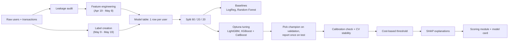

# FAM App — User Churn Prediction (Version 2)


> **In one sentence:** this project looks at how each user of the FAM payments app behaved during the first 20 days of a month and predicts **who is likely to go completely silent (zero transactions) over the following 11 days**, so the retention team can reach out *before* those users are gone.

Version 2 takes the earlier, simpler churn notebook and turns it into a **production-style pipeline**: tuned gradient-boosting models, a business-cost-based decision threshold, per-user explanations, segment analysis, and a ready-to-ship scoring module with a model card.

---

## Table of contents

1. [What problem are we solving?](#1-what-problem-are-we-solving)
2. [Key results at a glance](#2-key-results-at-a-glance)
3. [How it works (the big idea)](#3-how-it-works-the-big-idea)
4. [The data](#4-the-data)
5. [Pipeline walkthrough (13 stages)](#5-pipeline-walkthrough-13-stages)
6. [Feature engineering in detail](#6-feature-engineering-in-detail)
7. [Avoiding data leakage](#7-avoiding-data-leakage)
8. [Splitting, imbalance and models](#8-splitting-imbalance-and-models)
9. [Evaluation and how to read the metrics](#9-evaluation-and-how-to-read-the-metrics)
10. [Choosing the decision threshold (the business part)](#10-choosing-the-decision-threshold-the-business-part)
11. [Explainability with SHAP](#11-explainability-with-shap)
12. [Deployment package and scoring new users](#12-deployment-package-and-scoring-new-users)
13. [Monitoring plan](#13-monitoring-plan)
14. [Getting started](#14-getting-started)
15. [Repository structure](#15-repository-structure)
16. [Known limitations (please read)](#16-known-limitations-please-read)
17. [Roadmap](#17-roadmap)
18. [Glossary](#18-glossary)
19. [FAQ](#19-faq)

---

## 1. What problem are we solving?

A payments app makes money when people keep using it. When a user quietly stops transacting, that is **churn**. By the time someone has been silent for weeks, it is usually too late to win them back.

The business question:

> **Which users are likely to make zero transactions in the near future, so retention can step in early?**

Our precise definition of churn in this project:

| | |
|---|---|
| **Churn = 1** | The user made **zero** transactions in the label window (May 9 – May 19, 2025) |
| **Churn = 0** | The user made **at least one** transaction in that window |

This is a **binary classification** problem: for every user, the model outputs a probability between 0 and 1 (for example, "0.82 = 82% chance this user goes silent").

---

## 2. Key results at a glance

| Item | Value |
|---|---|
| Users | 500,000 |
| Transactions | about 4.05 million (Apr 19 – May 19, 2025) |
| Overall churn rate | about 20.6% |
| Input features | 25 (4 categorical, 21 numeric) |
| Champion model | **XGBoost (Optuna-tuned, 15 trials)** |
| Cross-validated PR-AUC (5-fold) | **0.8868 ± 0.0020** |
| Test PR-AUC | **0.8904** |
| Test ROC-AUC | **0.9655** |
| Test Brier score | **0.0635** |
| Deployed decision threshold | **0.61** (chosen by expected ₹ value, not by accuracy) |

> **Important context before quoting these numbers.** They come from a *random-by-user* split inside a *single month* of data, they score *all* users (including people who were already inactive), and the model uses four engagement columns whose computation window is unknown. All three can make the numbers look better than they will be on future data. See [Known limitations](#16-known-limitations-please-read) before using them as a production estimate.

---

## 3. How it works (the big idea)

### The exam-paper analogy

Imagine teaching a student with old exam papers:

- The **questions** are what you could see in advance.
- The **answers** are what happened afterward.

The student studies many question-and-answer pairs, learns the pattern, and is then asked to answer **new questions without the answer sheet**.

Our model works exactly like that, using **two time windows** split at a **cutoff date**:

```
Apr 19 ─────────────────────────── May 8 │ May 9 ─────────────────────── May 19
        FEATURE WINDOW (20 days)         │        LABEL WINDOW (11 days)
        "what we can observe"            │        "what happened next"
        becomes X (model inputs)         │        becomes y (churn 0 / 1)
                                         ▲
                                     CUTOFF
                                  (May 8, 23:59:59)
```

- **Feature window → the questions.** We summarise each user's behaviour (how often they paid, how recently, how much, and so on).
- **Label window → the answer.** Did the user transact at all in the next 11 days?

### Why two separate windows?

If you computed features and the label from the **same** period, the model would simply see the answer. Someone with no transactions in a period obviously "churned" in that period, so the model would look perfect in the notebook and be useless in real life. Splitting at a cutoff mimics reality: *standing on May 8, we only know the past.*

### A worked example

User `123` made three payments in the feature window and none afterward:

| Stage | What exists for this user |
|---|---|
| Raw data | 3 rows in the transactions table |
| After feature engineering | 1 row: `txn_count = 3`, `days_since_last_txn = 1`, `txn_trend = +1`, … |
| After labelling | the same row plus `churn = 1` (no transactions after May 8) |
| After preprocessing | a numeric vector the model can read |

The model learns from hundreds of thousands of rows like this, then predicts churn for users whose future is unknown.

### Pipeline at a glance


```mermaid
flowchart LR
    A["Raw users + transactions"] --> B["Leakage audit"]
    B --> C["Feature engineering<br/>(Apr 19 - May 8)"]
    A --> D["Label creation<br/>(May 9 - May 19)"]
    C --> E["Model table: 1 row per user"]
    D --> E
    E --> F["Split 60 / 20 / 20"]
    F --> G["Baselines<br/>LogReg, Random Forest"]
    F --> H["Optuna tuning<br/>LightGBM, XGBoost + CatBoost"]
    H --> I["Pick champion on validation,<br/>report once on test"]
    I --> J["Calibration check + CV stability"]
    J --> K["Cost-based threshold"]
    K --> L["SHAP explanations"]
    L --> M["Scoring module + model card"]
```

---

## 4. The data

Two CSV files are used (**not included in this repository**; place them locally and set the paths in the notebook):

### `fam_users.csv` — one row per user (500,000 rows)

| Column | Meaning | Used in model? |
|---|---|---|
| `user_id` | Unique user identifier | No (identifier only) |
| `registration_date` | When the user signed up | Yes, as `tenure_days_at_cutoff` |
| `age_group` | Age bucket (e.g. 16-18, 19-22, 31+) | Yes (categorical) |
| `city` | User's city | Yes (categorical) |
| `device_type` | Android / iOS etc. | Yes (categorical) |
| `has_customized_card` | Flag: customised their card | Yes |
| `has_set_savings_goal` | Flag: set a savings goal | Yes |
| `has_used_offers` | Flag: used offers | Yes |
| `app_opens_per_week` | Engagement | Yes — **flagged medium-risk** |
| `avg_session_duration` | Engagement | Yes — **flagged medium-risk** |
| `support_tickets` | Engagement | Yes — **flagged medium-risk** |
| `referrals_made` | Engagement | Yes — **flagged medium-risk** |
| `is_active` | 1 if `days_since_last_transaction` ≤ 14 | **No (leakage)** |
| `days_since_last_transaction` | Days since last transaction as of May 19 | **No (leakage)** |
| `days_since_registration` | Days since signup as of May 19 | **No (recomputed at the cutoff instead)** |

### `fam_transactions.csv` — one row per transaction (about 4.05 million rows)

| Column | Meaning |
|---|---|
| `transaction_id` | Unique transaction ID |
| `user_id` | Links to the users table |
| `transaction_date` | Timestamp of the transaction |
| `amount` | Transaction amount |
| `payment_method` | e.g. UPI |
| `transaction_type` | e.g. Travel, Entertainment, Bills |
| `merchant` | e.g. MakeMyTrip, BookMyShow, DTH |
| `status` | `Success` or `Failed` (about 4% fail) |
| `failure_reason` | Present only for failed transactions |

About 452,000 of the 500,000 users have at least one transaction. The rest are kept in the model table (not silently dropped) with activity features set to 0 and recency set to a sentinel value.

---

## 5. Pipeline walkthrough (13 stages)

The notebook `02_production_pipeline.ipynb` is organised into stages. Each stage is explained in plain words:

| # | Stage | What happens | Why it matters |
|---|---|---|---|
| 1 | **Business objective** | Defines the question, the two windows and what "success" means | Everyone agrees on the target before any modelling |
| 2 | **Data governance & leakage audit** | Proves `is_active` is a hard restatement of `days_since_last_transaction`; excludes leaky columns; flags engagement columns | Stops the model from cheating |
| 3 | **EDA** | Missing values, status mix, daily volume with the cutoff marked, category cardinality | Know the data before modelling it |
| 4 | **Feature engineering** | One reusable function builds all features strictly from rows up to the cutoff | Same code for training and live scoring |
| 5 | **Data splitting** | Train 60% / Validation 20% / Test 20%, stratified by churn | Honest evaluation |
| 6 | **Class imbalance** | Uses class weighting (`scale_pos_weight`) instead of SMOTE | No fabricated rows; simpler tuning |
| 7 | **Baselines** | Logistic Regression and Random Forest | A floor the boosters must beat |
| 8 | **Optuna tuning** | LightGBM and XGBoost, 15 trials each, scored on validation PR-AUC; CatBoost with fixed parameters | Systematic, not guessed, hyperparameters |
| 9 | **Selection, CV & calibration** | Pick the champion on validation, score once on test, run 5-fold CV, draw a reliability diagram | Is the result stable? Are probabilities trustworthy? |
| 10 | **Threshold optimisation** | Cost-based (₹ value), capacity-based (Precision@K) and F1-max thresholds | Turns a probability into an action |
| 11 | **Explainability (SHAP)** | Global importance, beeswarm plot and individual waterfall explanations | Retention teams need the *why* |
| 12 | **Business impact & segments** | Flagged users, precision/recall, ₹ value, churn by age/city/device | Translates the model into business language |
| 13 | **Deployment package** | Saves pipeline, `churn_scoring.py`, `model_card.json`, PSI monitoring helper | Something you can actually ship |

---

## 6. Feature engineering in detail

All transaction features come from **one function**, `build_features`, which only looks at transactions between the start of the data and the cutoff. The helper `assemble_modeling_table` joins them to the user table and (in training mode) creates the label.

### Transaction features

| Feature | How it is calculated | Why it helps |
|---|---|---|
| `txn_count` | Number of transactions in the feature window | Overall activity level |
| `total_amount` | Sum of amounts | How much money flows through the app |
| `avg_amount` | Mean amount | Typical transaction size |
| `std_amount` | Standard deviation of amounts | Steady versus erratic spending |
| `n_merchants` | Distinct merchants used | Breadth of usage |
| `n_payment_methods` | Distinct payment methods | Breadth of usage |
| `n_txn_types` | Distinct transaction types | Breadth of usage |
| `days_since_last_txn` | Cutoff date minus last transaction date | **Recency**, usually the strongest churn signal |
| `active_span_days` | Last transaction date minus first | How long the user stayed active inside the window |
| `failure_rate` | Share of transactions with status `Failed` | Failed payments frustrate users |
| `txn_count_early` | Transactions in the first half of the window | Early activity |
| `txn_count_late` | Transactions in the second half | Recent activity |
| `txn_trend` | `txn_count_late − txn_count_early` | Rising or fading (negative = slowing down) |
| `top_txn_type` | The user's most frequent transaction type | What they mainly use the app for |

### User-table features

| Feature | Notes |
|---|---|
| `tenure_days_at_cutoff` | Cutoff date minus registration date (recomputed, not taken from the snapshot column) |
| `age_group`, `city`, `device_type` | Categorical |
| `has_customized_card`, `has_set_savings_goal`, `has_used_offers` | Binary flags |
| `app_opens_per_week`, `avg_session_duration`, `support_tickets`, `referrals_made` | Medium-risk (unknown computation window); see below |

### Handling users with no transactions

Users with zero transactions in the feature window stay in the dataset. Their count/amount features are filled with `0`, `top_txn_type` becomes `"None"`, and `days_since_last_txn` is set to the sentinel value `999`.

---

## 7. Avoiding data leakage

**Data leakage** means the model gets access to information it would not have at prediction time. This notebook defends against it in four ways:

1. **Windows are enforced in code.** Features use only transactions with `date ≤ cutoff`; the label uses only `date > cutoff`.
2. **Snapshot columns are excluded.** `is_active`, `days_since_last_transaction` and the raw `days_since_registration` are measured as of May 19, so they describe the label window. The notebook proves `is_active` is a pure threshold (≤ 14 days → 1) with zero exceptions.
3. **Everything is recomputed relative to the cutoff**, for example tenure.
4. **Preprocessing is fit on training data only.** The scaler and one-hot encoder never see validation or test rows.

> **Governance note:** `app_opens_per_week`, `avg_session_duration`, `support_tickets` and `referrals_made` have no timestamp, so we cannot confirm they only describe the feature window. They are *kept but flagged*. In production, request timestamped event logs so the window can be controlled directly.

---

## 8. Splitting, imbalance and models

### Three-way split (stratified by churn)

| Set | Share | Purpose |
|---|---|---|
| Train | 60% | Fit each model |
| Validation | 20% | Used **only** by Optuna and early stopping |
| Test | 20% | Touched **once**, at the end, to report performance |

Using a separate validation set means hyperparameters cannot quietly overfit to the test set.

### Class imbalance

About 20.6% of users churn: imbalanced but not extreme. The notebook uses **class weighting** (`scale_pos_weight = non-churners ÷ churners`) built into each booster instead of SMOTE, because it does not fabricate rows and is cheaper to tune.

### Models compared

| Model | Tuning | Role |
|---|---|---|
| Logistic Regression | None | Baseline |
| Random Forest | None (300 trees, depth 10) | Baseline |
| LightGBM | Optuna, 15 trials | Candidate |
| **XGBoost** | **Optuna, 15 trials** | **Champion in the recorded run** |
| CatBoost | Fixed hyperparameters (not tuned, for runtime reasons) | Candidate |

Each Optuna trial trains with early stopping on the validation set and is scored on **validation PR-AUC**. The champion is chosen by validation PR-AUC and then confirmed on the test set.

---

## 9. Evaluation and how to read the metrics

| Metric | Result | Plain-English meaning |
|---|---|---|
| **PR-AUC** | 0.8904 (test) | How well the model ranks real churners near the top while staying precise. Preferred over accuracy for imbalanced data. A random model scores about the churn rate (≈ 0.21). |
| **ROC-AUC** | 0.9655 (test) | Chance that a random churner is scored higher than a random non-churner. 0.5 = coin flip, 1.0 = perfect. |
| **Brier score** | 0.0635 (test) | Average squared error of the predicted probabilities. Lower is better; measures how trustworthy the probabilities are. |
| **5-fold CV PR-AUC** | 0.8868 ± 0.0020 | Stability check on train + validation. A small spread means the result is not a lucky split. The folds use LightGBM with the tuned hyperparameters (a stability check, not re-tuning). |

**Why not accuracy?** With about 79% non-churners, a model that always says "will not churn" is 79% accurate and completely useless. PR-AUC and the business-value curve in Stage 10 are far more informative.

**Calibration.** The notebook draws a reliability diagram (predicted probability vs. observed churn rate). If the curve hugs the diagonal, probabilities can be read as real chances. The notebook states honestly that recalibration (for example isotonic regression) would be the fix if it deviates, and lists it as a follow-up rather than applying it silently.

---

## 10. Choosing the decision threshold (the business part)

A model outputs probabilities. To act, you need a rule such as "contact everyone above X". The best X depends on money, not statistics.

### A) Cost-based (expected value): the deployed method

Business assumptions (**placeholders, replace with real finance/marketing numbers before production**):

| Assumption | Value |
|---|---|
| Average customer value retained | ₹2,000 |
| Cost of one retention contact | ₹150 |
| Campaign save rate (share of at-risk users the campaign actually keeps) | 25% |

From these:

- Contacting a **true churner** earns `0.25 × 2000 − 150 = ₹350` on average.
- Contacting a **non-churner** wastes `₹150`.

The notebook sweeps thresholds from 0.01 to 0.99, computes the expected net ₹ value on the test set at each, and picks the best. The recorded run selected **0.61**. It also compares against two baselines: **target no one (₹0)** and **target everyone**.

### B) Capacity-based (Precision@K)

If the team can only call a fixed number of users per week, a threshold is unnecessary: take the top K by risk. The notebook reports precision and recall for K = 500, 1,000, 2,000, 5,000 and 10,000.

### C) F1-max

Kept for reference only (this was the primary choice in the earlier notebook). The deployed rule uses the cost-based threshold because it reflects the ₹ trade-off directly.

---

## 11. Explainability with SHAP

A bare risk score is hard to act on. SHAP values show, for each prediction, which features pushed the risk up or down.

The notebook produces:

- **Global importance bar chart**: mean |SHAP| per feature (computed on a 2,000-row test sample).
- **Beeswarm plot**: direction and size of each feature's effect (red = high feature value, blue = low).
- **Two individual waterfall plots**: one correctly flagged churner and one missed churner (false negative), so you can see both a success and a failure of the model.

Features like `days_since_last_txn` and `txn_count` are expected to dominate. If they do not, that is a sign something is wrong. SHAP plots run for the tree champions (LightGBM / XGBoost).

---

## 12. Deployment package and scoring new users

Running Stage 13 writes three artifacts into `model_artifact/`:

| File | What it is |
|---|---|
| `churn_pipeline.joblib` | The fitted preprocessing + champion model, refit on train + validation |
| `churn_scoring.py` | A standalone module containing the **same** `build_features` / `assemble_modeling_table` used in training, plus `score_users(...)` |
| `model_card.json` | Features, exclusions, metrics, threshold, assumptions and limitations |

Keeping the feature code in the scoring module is deliberate: **train/serve skew** (training and serving code quietly diverging) is one of the most common causes of broken churn models.

### Scoring example

```python
import sys
import pandas as pd

sys.path.insert(0, "model_artifact")
from churn_scoring import score_users

users = pd.read_csv("fam_users.csv", parse_dates=["registration_date"])
txns  = pd.read_csv("fam_transactions.csv", parse_dates=["transaction_date"])

cutoff        = pd.Timestamp("2025-05-08 23:59:59")   # "today" in a live run
feature_start = cutoff - pd.Timedelta(days=20)        # keep the ~20-day window used in training

scored = score_users(users, txns, cutoff, feature_start)

# columns: user_id, churn_probability, churn_flag (1 if probability >= 0.61)
at_risk = scored[scored.churn_flag == 1].sort_values("churn_probability", ascending=False)
print(at_risk.head(10))
```

> **Window length matters.** Features like `txn_count` scale with how many days you look back, so always pass a `feature_start` that gives roughly the same ~20-day window the model was trained on.

### Suggested operating rhythm

1. **Monthly retraining**: as new months arrive, stack several (feature window → label window) pairs per user and re-run Stages 5–10.
2. **Weekly / monthly scoring**: call `score_users(...)` with `cutoff = today`; send `churn_flag == 1` users to the retention workflow.
3. **Feedback loop**: log which flagged users were actually retained and use it to replace the assumed 25% save rate with a measured number.
4. **Governance**: update `model_card.json` on every retrain, not just the model file.

---

## 13. Monitoring plan

Models decay as user behaviour changes. The notebook ships a **Population Stability Index (PSI)** helper that compares a feature's training distribution to a new scoring batch:

| PSI | Meaning | Action |
|---|---|---|
| < 0.10 | No significant shift | Nothing |
| 0.10 – 0.25 | Moderate shift | Investigate |
| > 0.25 | Major shift | Retrain |

**Retrain triggers** (whichever comes first): a second month of data becomes available, any monitored feature exceeds PSI 0.25, or the monthly schedule.

---

## 14. Getting started

### Requirements

- Python 3.9 or newer (recommended)
- Jupyter Notebook or JupyterLab
- Enough RAM for about 4 million transaction rows (a few GB is comfortable)

```bash
git clone <your-repo-url>
cd <your-repo-name>

python -m venv .venv
source .venv/bin/activate          # Windows: .venv\Scripts\activate

pip install pandas numpy scikit-learn lightgbm xgboost catboost optuna shap matplotlib joblib jupyter
```

### Run it

1. Put `fam_users.csv` and `fam_transactions.csv` somewhere on your machine.
2. Open `02_production_pipeline.ipynb`.
3. **Edit the hard-coded paths** (they point to the original environment):
   - In the data-loading cell: `USERS_PATH` and `TXN_PATH`
   - In the deployment cell: `OUT_DIR`
   - In the `%%writefile` cell: the path after `%%writefile` (that magic does not accept variables, so change the text itself)
4. Run all cells from top to bottom. Tuning (15 Optuna trials for each of two models) is the slowest part; expect anywhere from several minutes to over an hour depending on your hardware.
5. Find the outputs in `model_artifact/`.

---

## 15. Repository structure

A suggested layout (adjust to your repo):

```
.
├── README.md
├── 02_production_pipeline.ipynb      # the full Version 2 pipeline
├── data/                             # NOT committed - add to .gitignore
│   ├── fam_users.csv
│   └── fam_transactions.csv
└── model_artifact/                   # produced by Stage 13
    ├── churn_pipeline.joblib
    ├── churn_scoring.py
    └── model_card.json
```

Add `data/` and large model files to `.gitignore` (or use Git LFS) rather than committing them.

---

## 16. Known limitations (please read)

Being upfront about these is part of the design. Most are also recorded in `model_card.json`.

1. **One month of data only.** There is a single feature/label window pair and no out-of-time validation. The split is random by row, not by time, so performance on *future* months is unproven.
2. **Medium-risk engagement columns.** `app_opens_per_week`, `avg_session_duration`, `support_tickets` and `referrals_made` have an unknown computation window. If they reflect activity after the cutoff, they leak the answer and inflate the metrics. The very high ROC-AUC (0.9655) is a reason to verify this with the data owners, for example by retraining without these four columns and comparing.
3. **All users are scored, including already-inactive ones.** About 48,000 users have no transactions at all and many more have been silent for weeks. These are trivial to predict and push PR-AUC and ROC-AUC upward. A more realistic view scores only users who were recently active.
4. **Recency sentinel quirk.** The line `days_since_last_txn.replace(0, 999)` also maps users whose last transaction was *on the cutoff day* (0 days ago) to 999, the "no activity" value, which is the opposite of the truth for those very recent users. The rest of the logic already handles users with no transactions, so this replacement is unnecessary and should be removed.
5. **Threshold chosen on the test set.** The ₹-optimal threshold (0.61) is selected using test-set predictions, which is slightly optimistic. Choosing it on validation data is safer.
6. **Refit differs from evaluated model.** The deployed pipeline is refit on train + validation with a fixed tree count (not the early-stopped count), so the shipped model is not identical to the one that produced the reported test metrics.
7. **Probabilities are not recalibrated.** Calibration is *checked*, not corrected. Do not use raw probabilities for further financial modelling without recalibrating.
8. **Placeholder business numbers.** Customer value, campaign cost and save rate are assumptions, so the ₹ figures are illustrative only.
9. **CatBoost is untuned**, so the three-way comparison is not perfectly like-for-like.
10. **Paths are hard-coded** to the original environment and must be edited before running elsewhere.

---

## 17. Roadmap

Ideas to take this from "solid single-month build" to a fully production system:

- **Rolling snapshots.** Build a feature/label pair for many cutoff dates and stack them (many more training rows, and a true forward-in-time test).
- **Split by user and by time**, so near-duplicate rows never appear in both train and test.
- **Score only currently-active users** for a more honest headline metric.
- **Richer features**: multi-scale windows (3 / 7 / 14 days), purchase-rhythm gaps and "overdue versus this user's own pattern", momentum ratios.
- **Replace the engagement columns** with timestamped event logs.
- **Recalibrate** with isotonic regression, and pick the threshold on validation data.
- **Run a randomised retention experiment** to measure the real save rate and train an *uplift* model (who is *persuadable*, not just who is at risk).
- **Automate** retraining, PSI alerts and live precision@K tracking.

Several of these are implemented in the next-generation notebook `03_production_pipeline_v3.ipynb`.

---

## 18. Glossary

| Term | Plain-English meaning |
|---|---|
| **Churn** | A user going silent (here: zero transactions in the label window) |
| **Feature window / label window** | The "what we can see" period and the "what happened next" period, split at the cutoff |
| **Cutoff** | The date separating past (features) from future (label): May 8, 2025 |
| **Data leakage** | The model seeing information it would not have at prediction time |
| **Train / validation / test** | Learn / tune / final exam |
| **Class imbalance** | One outcome (non-churn) being much more common than the other |
| **Gradient boosting** | A model that builds many small decision trees, each correcting the last (LightGBM, XGBoost, CatBoost) |
| **Optuna** | A library that searches for good hyperparameters automatically |
| **PR-AUC** | Area under the precision-recall curve; robust for imbalanced data |
| **ROC-AUC** | Area under the ROC curve; chance of ranking a random churner above a random non-churner |
| **Brier score** | Average squared error of predicted probabilities (lower is better) |
| **Calibration** | Whether "70% risk" really means about 70 in 100 such users churn |
| **Precision / Recall** | Of those flagged, how many were real churners / of all real churners, how many we caught |
| **Precision@K** | Precision among the top K highest-risk users |
| **SHAP** | A method that explains how much each feature pushed a prediction up or down |
| **PSI** | Population Stability Index: a score for how much a feature's distribution has drifted |
| **Train/serve skew** | Training and live scoring computing features differently |
| **Model card** | A short document recording what a model does, its data, metrics and limits |

---

## 19. FAQ

**Why is the label window after the cutoff?**
Because in real life you predict the future from the past. Building the label from earlier data would let the model see the answer.

**Why PR-AUC and not accuracy?**
With roughly 79% non-churners, "always predict no churn" is 79% accurate and worthless. PR-AUC focuses on how well we find the churners.

**Why class weighting instead of SMOTE?**
It does not invent synthetic users, it is cheaper to tune, and an earlier comparison on the same data showed no meaningful F1 difference.

**Why is the threshold 0.61 and not 0.5?**
Because it is chosen by expected ₹ value: each contact costs money, and only some contacted churners are actually saved. The statistical default of 0.5 ignores that.

**Can I use this on new data?**
Yes, via `score_users(...)`, but the model was trained on one month. Treat results as a starting point and retrain as more months arrive.

**Why is the dataset not in the repo?**
It is large and may contain sensitive information. Keep it out of version control.

---

## License and contact

Add your license here (for example MIT) and your contact or author details.
